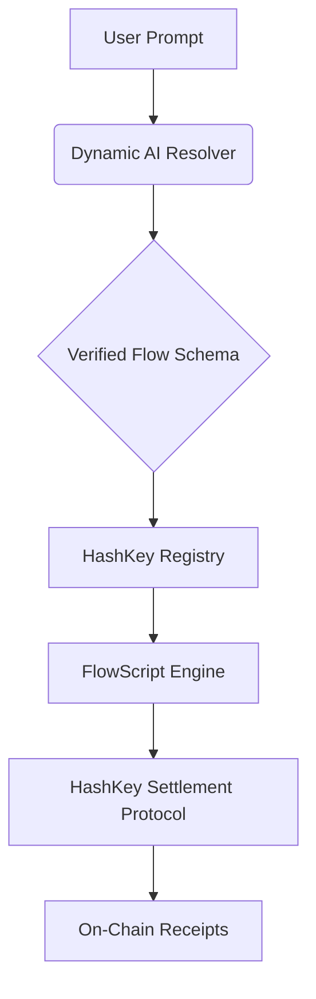

# 💸 FlowScript (PayFi) — Natural Language Payment Programming
**The world's first AI-driven Natural Language Payment Programming Protocol**  
Built on **HashKey Chain** · HSP-native · Hackathon 2026

[](https://hashkey.blockscout.com)
[](https://hashfans.io)
[](https://deepmind.google/technologies/gemini/)

---

## 🚀 Overview

**FlowScript** (built on the PayFi Protocol) is a decentralized system that converts natural language intent into persistent, autonomous on-chain payment programs. Leveraging the **HashKey Settlement Protocol (HSP)**, FlowScript enables users to automate complex financial flows—recurring salaries, split-pays, and conditional disbursements—using nothing but plain English.

### "Send 0.001 HSK to Alice every Friday, and split 10% of my incoming USDT between my savings and charity."

With FlowScript, that intent becomes a secure, verifiable, and non-custodial smart contract program on the HashKey Chain.

---

## ✨ Key Features

- **🗣️ Conversational Deployment**: No complex forms. An AI-first interface parses intent and generates structured on-chain rules.
- **🔄 Dynamic Multi-Tier AI Engine**: A fail-safe parsing system that intelligently rotates between **Gemini 3 Flash**, **1.5 Flash**, and **Pro** to guarantee 100% uptime and intent resolution.
- **📊 Real-time FinTech Analytics**: Integrated dashboard monitoring transaction volume, success rates, and token flow distribution.
- **⚡ Event-Driven Activity Feed**: Live monitoring of the entire lifecycle: *Intent Parsed → Flow Deployed → Execution Confirmed*.
- **🛡️ HSP-Native Settlement**: Full integration with the HashKey Settlement Protocol for secure, verifiable payment requests and receipt messaging.
- **🏗️ Structured Split Payments**: Programmatic distribution of funds by percentage or fixed value across multiple recipients.

---

## 🛠️ Technical Architecture

FlowScript operates as a three-layer optimized system:

1.  **AI Parsing Engine**: Powered by **Google Gemini**, converting natural language into a structured `PaymentProgram` JSON schema via a custom system-instruction layer.
2.  **On-Chain Registry**: `PayFiRegistry.sol` (deployed at `0x46251757A...`) stores programs on HashKey Chain, ensuring immutable ownership and execution.
3.  **Execution & Settlement**: `PayFiExecutor.sol` routes disbursements through **HSP**, handling the full cryptographic lifecycle (Request → Confirmation → Receipt).



---

## 📦 Project Structure

```text
payFi/
├── contracts/          # Solidity Smart Contracts (Hardhat)
│   ├── contracts/      # PayFiRegistry, PayFiExecutor, PayFiKeeper
│   └── scripts/        # Deployment scripts for Chain 133
├── frontend/           # Next.js Application
│   ├── app/            # Analytics, History, & AI API Routes
│   ├── components/     # Chat Engine, Activity Feed, QR Handshake
│   ├── lib/            # Multi-tier AI Resolvers
│   └── config/         # On-chain Contract Mappings
└── FlowScript_Report.md # Full Architectural Audit
```

---

## 🚀 Deployment & Installation

### Prerequisites
- Node.js v18+ 
- HashKey Chain Testnet Account with HSK

### Installation & Run
1. **Clone & Setup**:
   ```bash
   git clone https://github.com/Lakshmikanth-3/payFi.git
   cd payFi/frontend
   npm install
   ```
2. **Environment**: Create `.env.local` in `frontend/`:
   ```env
   GEMINI_API_KEY=your_key
   ```
3. **Execution**:
   ```bash
   npm run build
   npm run start
   ```

---

## 🔗 Submission Details
- **Network**: HashKey Chain Testnet (ChainID 133)
- **Registry Address**: `0x46251757A0008728C4Ac5766A5874f8bf1815484`
- **Explorer**: [HashKey BlockScout](https://testnet-explorer.hsk.xyz)

---
*Built with ❤️ for the HashKey Chain Hackathon 2026*
