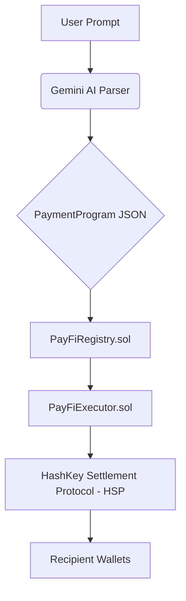

# 💸 PayFi — Natural Language Payment Programming Protocol

> **The world's first Natural Language Payment Programming Protocol**  
> Built on **HashKey Chain** · HSP-native · Hackathon 2026

[](https://hashkey.blockscout.com)
[](https://hashfans.io)
[](https://deepmind.google/technologies/gemini/)

---

## 🚀 Overview

**PayFi** is a revolutionary decentralized protocol that converts plain-English payment intent into persistent, on-chain payment programs. Leveraging the **HashKey Settlement Protocol (HSP)**, PayFi enables anyone—from freelancers to DAOs—to automate complex financial logic without writing a single line of code.

### "Pay Alice 500 USDC every Friday, and split 20% of my incoming deposits between Bob and Carol."

With PayFi, that sentence becomes a secure, autonomous, and verifiable on-chain program on the HashKey Chain.

---

## ✨ Key Features

- **🗣️ Natural Language Interface**: No complex forms. Just type how you want to pay.
- **🔄 Recurring Payments**: Set up cron-based schedules (daily, weekly, monthly) in seconds.
- **⚡ Event-Driven Logic**: Trigger payments based on incoming deposits or balance changes.
- **🏗️ Structured Split Payments**: Easily split incoming funds by percentage or fixed amounts.
- **🛡️ HSP Integration**: Native support for HashKey Settlement Protocol for secure request, confirmation, and receipt messaging.
- **📊 Real-time Dashboard**: Monitor every execution with direct links to the HashKey BlockScout explorer.

---

## 🛠️ Architecture

PayFi operates as a three-layer system:

1.  **AI Parser Layer**: Powered by **Google Gemini**, converting natural language into structured `PaymentProgram` JSON.
2.  **On-Chain Registry**: `PayFiRegistry.sol` stores programs on HashKey Chain, ensuring persistence and ownership.
3.  **Execution Layer**: `PayFiExecutor.sol` routes payments through **HSP**, handling the full settlement lifecycle (Request → Confirmation → Receipt).



---

## 📦 Project Structure

```text
payFi/
├── contracts/          # Solidity Smart Contracts (Hardhat)
│   ├── contracts/      # PayFiRegistry, PayFiExecutor, PayFiKeeper
│   └── scripts/        # Deployment scripts for HashKey Chain
├── frontend/           # Next.js Application
│   ├── app/            # Main application pages & API routes
│   ├── components/     # Chat UI, Program Cards, Dashboard
│   ├── lib/            # AI Parser integration (Gemini API)
│   └── config/         # Wagmi & Network configuration
└── payFi_PRD.md        # Detailed Product Requirements Document
```

---

## 🚀 Getting Started

### Prerequisites

- [Node.js](https://nodejs.org/) (v18+)
- [MetaMask](https://metamask.io/) or [OKX Wallet](https://www.okx.com/web3)
- HashKey Chain Testnet/Mainnet HSK for gas

### Installation

1.  **Clone the repository:**
    ```bash
    git clone https://github.com/Lakshmikanth-3/payFi.git
    cd payFi
    ```

2.  **Install dependencies:**
    ```bash
    # For Frontend
    cd frontend && npm install
    
    # For Contracts
    cd ../contracts && npm install
    ```

3.  **Set up environment variables:**
    Create a `.env` file in the `frontend` directory with your Gemini API key:
    ```env
    GEMINI_API_KEY=your_gemini_api_key_here
    ```

4.  **Run locally:**
    ```bash
    cd frontend
    npm run dev
    ```

---

## 🔗 Links

- **Block Explorer**: [HashKey BlockScout](https://hashkey.blockscout.com)
- **HSP Docs**: [HashKey Settlement Protocol](https://hashfans.io)
- **PRD**: [Full Requirements Document](./payFi_PRD.md)

---

## 🏆 Hackathon Credits

Built for the **HashKey Chain Hackathon 2026** - PayFi Track.

*Designed to bridge the gap between human intent and on-chain execution.*
